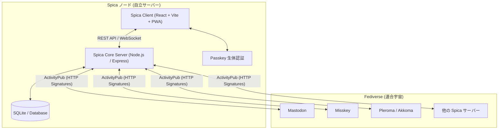

# Spica（スピカ）の仕組みと目指しているもの
### — 自立分散型ソーシャルネットワークが切り拓く、新しいデジタルの夜空 —

---

## 1. はじめに — Spicaとは何か

**Spica（スピカ）** は、おとめ座で最も強く輝く青白い一等星の名を冠した、**オープンで自立分散型のソーシャルネットワーキング・プラットフォーム** です。

現代のインターネットにおいて、SNSは私たちの社会生活や言論、人間関係のインフラとなりました。しかし、その多くはごく少数の巨大テック企業（Big Tech）によって中央集権的に管理・支配されています。

Spicaは、ひとつの巨大なサーバーや単一の企業にすべてを委ねるのではなく、**無数の独立したノード（サーバー）が自立しながら対等につながり合う「分散型（Fediverse / 連合型）」の未来** を目指して開発されています。

誰もが自分自身の居場所を持ち、自分の言葉とデータを自らの手に取り戻す。夜空に浮かぶ星々が集まって美しい星座を形作るように、人と人とが自由につながり合える空間——それがSpicaです。

---

## 2. Spicaが目指しているもの（理念・ビジョン）

### ① プラットフォームへの従属からの解放（データ主権の奪還）
従来のSNSでは、ユーザーの投稿、フォロワーリスト、日々の交流記録、さらには閲覧履歴などのあらゆる個人データが中央サーバーのデータベースに蓄積され、広告ビジネスの糧として利用されています。また、プラットフォームの規約改定や経営方針の変更、アカウント凍結によって、築き上げた人間関係が一瞬で失われるリスクを常に抱えています。

Spicaが目指すのは、**「自分のデータは自分だけのもの」** という本来あるべき姿です。
ユーザーは信頼できるサーバーを選ぶことも、あるいは自分自身で小さなサーバーを立ち上げることもできます。他者の都合によってあなたの声が奪われることはありません。

### ② 「アルゴリズムに飼いならされない」自然なつながり
中央集権型SNSの多くは、ユーザーの滞在時間を最大化し広告を見せるために、怒りや対立を煽るアルゴリズムを採用しています。その結果、タイムラインは刺激的で攻撃的なコンテンツに満ち、精神的な疲弊（SNS疲れ）を生み出しています。

Spicaには、**感情を煽ってユーザーをコントロールする不透明なレコメンドアルゴリズムは存在しません**。
タイムラインは純粋にあなたがフォローした人たちの声、あなたが興味を持ったチャンネル、そしてローカルコミュニティの会話によって時系列で静かに流れます。健全で穏やかな対話と、本当に関心のある情報だけが届く場所を提供します。

### ③ 誰でも建てられ、永続できる「手のひらサイズの宇宙」
既存の分散型SNSソフトウェアの多くは、運用にハイスペックなサーバーや複雑なミドルウェア（PostgreSQL, Redis, Elasticsearch, Docker cluster等）を要求し、個人が自宅サーバーや低価格VPSで運用するには高いハードルがありました。

Spicaは、**「超軽量・自己完結型」** を強く意識して設計されています。
安価な月額数百円のVPSはもちろん、自宅のRaspberry PiやミニPCでも驚くほど軽快に動作します。「誰もが自分の星（サーバー）を持てる世界」を実現することが、真の分散化への第一歩だと考えています。

### ④ 多様性と自治（ローカルカルチャーの保護）
ひとつの巨大な空間に何億人もの人々を押し込めれば、文化の衝突や過度な分断が避けられません。
Spicaでは、各サーバーが独自のルール、テーマ、モデレーション方針、そしてカスタム絵文字を持つことができます。「ゲーム好きが集まる星」「創作やイラストを愛でる星」「技術を語り合う星」など、小さく温かいコミュニティが共存し、互いに礼節を持って通信し合う世界を尊重します。

---

## 3. Spicaの仕組み（アーキテクチャとテクノロジー）

Spicaは、最新のWeb標準技術とオープンプロトコルを統合することで、堅牢かつ親しみやすいユーザー体験を実現しています。

### ① W3C標準プロトコル「ActivityPub」による相互接続
Spicaは、Web標準化団体であるW3Cが勧告する分散型SNS通信規格 **ActivityPub** を完全サポートしています。
これにより、Spicaのユーザーは世界中の **Mastodon、Misskey、Pleroma、Pixelfed** などの数百万人のユーザーと、プラットフォームの壁を越えて以下のような交流が可能です：
- 相互フォロー / アンフォロー
- ノート（投稿）の送受信
- リアクション（お気に入り / 絵文字リアクション）
- リノート / ブースト（拡散）
- リプライ（返信ツリーの同期）

### ② 公開鍵暗号（HTTP Signatures）とWebFingerによる信頼モデル
分散環境において「その投稿が本当にその人物によって送信されたか」を証明するため、Spicaは各アカウントごとに固有の **RSA公開鍵・秘密鍵ペア** を自動生成します。
- **HTTP Signatures**: サーバー間でメッセージを配送する際、送信元の秘密鍵でデジタル署名を付与し、受信側ノードが公開鍵で検証します。これにより、なりすましや改ざんを数学的に防止します。
- **WebFinger**: `@username@domain.com` という形式のアドレスから、相手のプロファイルや鍵情報（Actor JSON）を安全に自動解決します。

### ③ 超軽量・高密度なアーキテクチャ
- **自己完結型ストレージ**: 外部の巨大なデータベースクラスタを必要とせず、高速かつ堅牢なSQLite（および最適化されたインデックス設計）をコアに採用。バックアップも単一ファイルのコピーで完了します。
- **効率的なメディア処理**: 画像のアップロード時には自動でメタデータのストリップ（位置情報の削除などプライバシー保護）と最適なWebP形式への圧縮を行い、回線とディスク容量を節約します。

### ④ 次世代セキュリティ：パスキー（WebAuthn / 生体認証）
パスワードの流出やフィッシング詐欺からユーザーを守るため、**WebAuthn（パスキー）** にネイティブ対応しています。
スマートフォンの指紋認証（Touch ID / 生体認証）やFace ID、Windows Hello、ハードウェアセキュリティキー（YubiKey等）を用いて、パスワードを入力することなく瞬時に、かつ極めて安全にログインできます。

### ⑤ ネイティブアプリ級の PWA（Progressive Web App）
Spicaはブラウザから直接使えるだけでなく、スマートフォン（Android / iOS）やPCのデスクトップに **「アプリ」としてインストール** できます。
- **完全なオフライン耐性**: Service Worker によるシェルキャッシュ。
- **Web Push 通知**: アプリを閉じていても、リプライやリアクションをリアルタイムにプッシュ通知で受信。
- **Maskable Icon & Back-Trap**: Android標準の適応型アプリアイコンと、スワイプ戻る誤操作によるアプリ脱出を防ぐ堅牢なナビゲーションガードを完備。

---

## 4. Spicaならではの豊かな体験

Spicaは、単に「技術的に分散している」だけではありません。日々のコミュニケーションを楽しく、心地よいものにするための多彩な機能を備えています。

| 機能 | 概要 |
| :--- | :--- |
| **カスタム絵文字リアクション** | 💖や👍だけでなく、サーバー独自の多彩なカスタム絵文字で感情を豊かに表現できます。Misskey等の連合サーバーとも相互送受信可能です。 |
| **トピック別チャンネル** | タイムライン全体に流すのではなく、「特定の話題（ゲーム、技術、創作など）」に絞って会話を楽しめるチャンネル機能を完備。 |
| **キーワード・アンテナ** | 気になるキーワードを登録しておくと、連合を含むタイムライン全体から該当する話題を自動で収集・通知します。 |
| **予約投稿 & 下書き保存** | 「明日の朝に告知したい」「アイデアをメモしておきたい」というニーズに応えるローカル＆リモート予約投稿と下書き管理。 |
| **高度なプライバシー設定** | 公開、未収載（ホームのみ）、フォロワー限定、ダイレクト（DM）の4段階の公開範囲制御に加え、強力なミュート・ブロック機能。 |

---

## 5. これからのSpica（ロードマップと未来展望）

Spicaは現在も進化を続けています。今後、以下の領域に注力して開発が進められます：

1. **ポータブル・アイデンティティ（アカウント移行の完全自動化）**:
   所属しているサーバーが万一停止した場合でも、フォロワーや投稿履歴を新しいサーバーへシームレスに引き継げる仕組みの強化。
2. **エンドツーエンド暗号化（E2EE）ダイレクトメッセージ**:
   サーバー管理者であっても中身を閲覧できない、真にプライベートな1対1およびグループ暗号化チャットの実現。
3. **P2Pメディア配信の実験的統合**:
   画像や動画などの大容量メディアをIPFSや分散ストレージネットワークと連携させ、個人のサーバー負荷を極限まで低減する試み。

---

## 6. 結びに代えて — あなたの星を灯そう

Spicaは、誰かひとりのカリスマや、株主の利益のために存在する場所ではありません。
オープンソースを愛し、自由な対話を重んじ、自分の言葉を自分の手に取り戻したいと願う **すべての人のためのネットワーク** です。

あなたも、Spicaという広大な夜空に、自分だけの光を灯してみませんか？

---
*Spica Development Team — Next Generation Federated Social Network*
